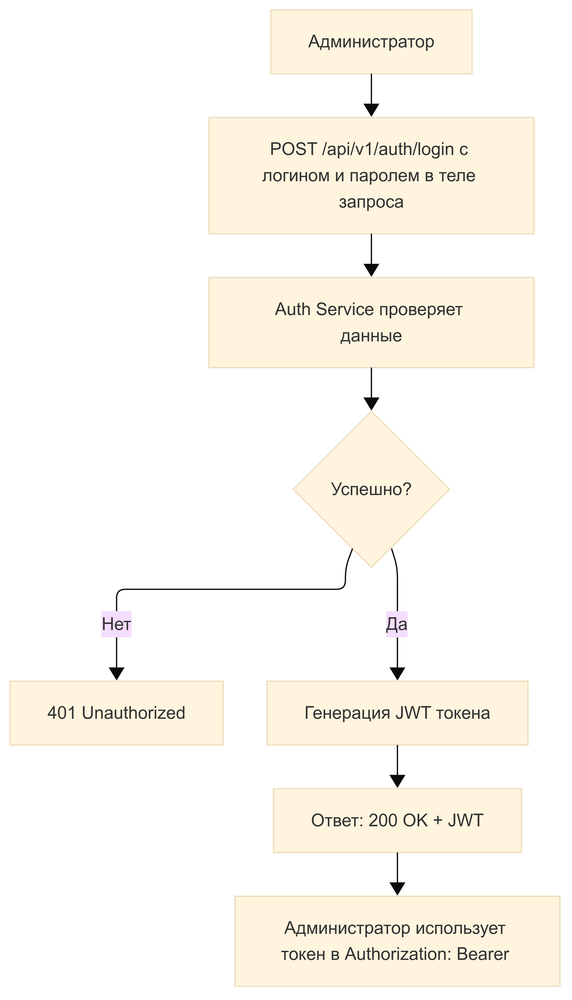
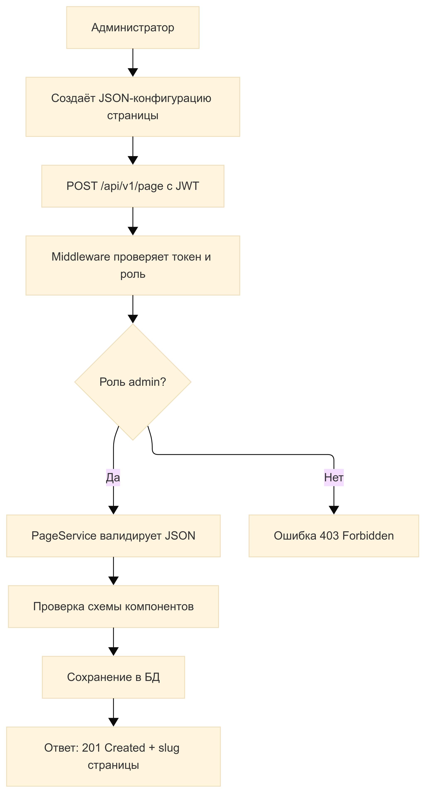
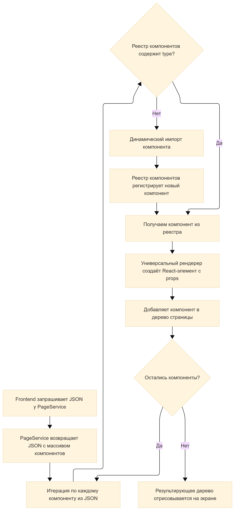
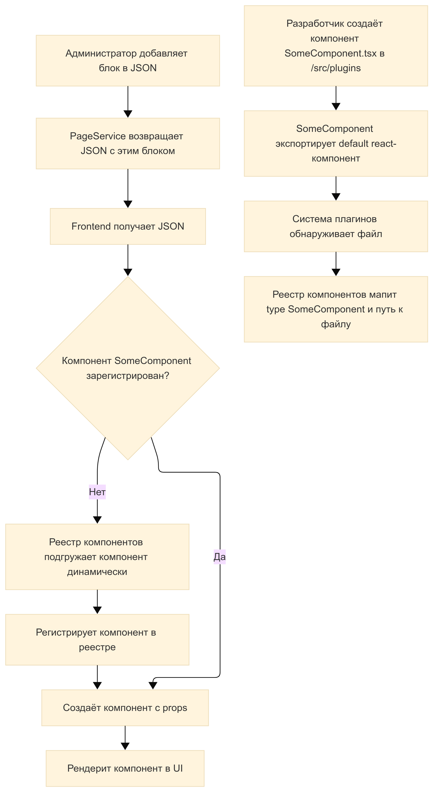
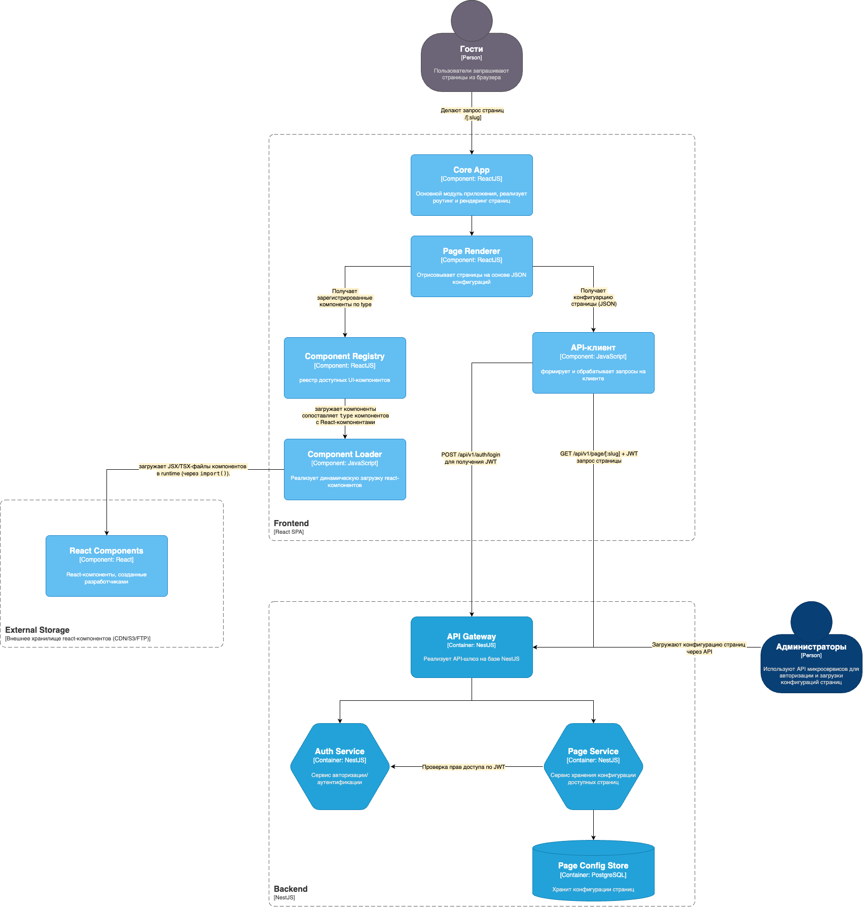

[TOC]
## Техническое задание
### Описание системы
Система представляет собой CMS (Content Management System), которая позволяет динамически формировать веб-страницы из набора переиспользуемых компонентов.

Ключевые характеристики:
- Страница состоит из набора компонентов.
- Каждый компонент имеет настраиваемые параметры (конфигурация, данные, стили и т. д.).
- Компоненты подключаются как плагины, обеспечивая модульность и расширяемость системы.
- Реализован универсальный контроллер, который динамически генерирует страницу на основе конфигурации компонентов.
- Система авторизации и разграничения прав для управления доступом к редактированию и просмотру контента.

### Бизнес требования
- **Универсальность генерации страниц.** Контроллер генерации страницы должен обрабатывать произвольные комбинации компонентов и их параметров. Каждый компонент должен иметь свой набор настраиваемых параметров (например, заголовок, контент, стили). Параметры хранятся в структурированном виде (JSON, БД). Контроллер генерации страницы должен обрабатывать произвольные комбинации компонентов и их параметров.
- **Авторизация и управление доступом.** Система предоставляет возможность аутентификации пользователей и обеспечивает ролевую модель доступа управления компонентами и страницами. Например, администратор имеет полный доступ к управлению компонентами и страницами. Гости могут только просматривать страницы, доступ к которым разрешен.
- **Гибкость и модульность.** Компоненты должны подключаться как плагины, чтобы их можно было добавлять/удалять без изменения ядра системы. 
- **Расширяемость.** Система должна позволять добавлять новые типы компонентов без переписывания основного кода.

## Техническое решение

### Стиль архитектуры

Выбранный стиль архитектуры - модульная микросервисная архитектура с элементами чистой архитектуры.
- Микросервисы позволяют разделить ответственность по сервисам: **Auth**, **Pages**
- Чистая архитектура гарантирует инверсию зависимостей, изоляцию бизнес-логики от фреймворков (ядро не зависит от внешних слоев).
- Плагинная архитектура обеспечивает поддержку подключения новых компонентов без изменения ядра

### Бизнес-процессы

Основная цель CMS - позволить пользователю с правами администратора создавать, редактировать и публиковать страницы, состоящие из динамически настраиваемых компонентов, которые подгружаются как плагины и рендерятся на клиенте. На первоначальном этапе разработка графического интерфейса для создания или редактирования страниц не предусмотрена. Предполагается загрузка JSON-файла конфигурации страницы для создания/редактирования доступных страниц.

**Участники системы:**
- Администратор - может редактировать, настраивать и публиковать страницы.
    - Загружает JSON-файл конфигурации страницы (через API).
    - JSON описывает структуру и параметры компонентов.
    - Страница публикуется (сохраняется в БД и доступна гостям по URL).
- Гость	- неавторизованный пользователь, может просматривать опубликованные страницы
    - Получает страницу по URL и просматривает её.
    - Не имеет доступа к загрузке JSON или внутренним данным.

#### 1. Аутентификация и авторизация
- **Цель:** разграничить доступ между гостем и администратором
- **Участники:** Администратор, AuthService
- **Этапы:**
    - Администратор отправляет логин/пароль на `/api/v1/auth/login`
    - AuthService генерирует JWT
    - Токен используется для защищённых запросов

**Функциональный процесс 1: Аутентификация администратора**

#### 2. Загрузка страницы (JSON)
- **Цель:** Создание/редактирование страницы и ее публикация
- **Участники:** Администратор, PageService
- **Этапы:** 
    - Администратор использует PageService для создания/редактирования страницы, путем передачи JSON-конфигурации через API (JSON создается вне системы, например вручную или через другую графическую систему администрирования)
    - PageService использует middleware, которая обеспечивает проверку токена, проверку роли admin, обеспечивает ограничение доступа к API (публикация, редактирование страниц)
    - PageService валидирует JSON
    - Компоненты валидируются по схемам
    - Конфигурация страницы сохраняется в БД
    - Страница будет доступна по адресу `/[:slug]`

**Функциональный процесс 2: Загрузка страницы (администратор)**
    

#### 3. Просмотр страницы (гость)
- **Цель:** гость открывает URL страницы
- **Участники:** Гость, Frontend SPA (React), Page Service
- **Этапы:**
    - Гость переходит по URL (например, `/home`)
    - Frontend отправляет GET-запрос в api по адресу `/api/v1/page/[:slug]`
    - PageService ищет конфигурацию по slug (`home`)
    - Компоненты отдаются в виде JSON
    - Frontend отображает страницу, динамически собирая UI из компонентов

**Функциональный процесс 3: Просмотр страницы (гость)**

#### 4. Рендеринг страницы (frontend)
- **Цель:** динамическая генерация страниц на фронтенде
- **Участники:** Frontend SPA (React), Page Service (Backend)
- **Этапы:** 
    - Frontend получает JSON от PageService 
    - Возвращается JSON с массивом компонентов: каждый содержит type, props, id, order и другие атрибуты
    - Frontend проверяет, зарегистрирован ли компонент с указанным type в реестре компонентов
    - Если компонент не найден — реестр пытается динамически зарегистрировать компонент (через механизм плагинов)
    - Реестр компонентов подгружает соответствующий React-компонент
    - Универсальный рендерер собирает UI: динамически создаёт дерево компонентов, передавая им props
    - Результат рендерится на экране

**Функциональный процесс 4: Рендеринг на клиенте**

#### 5. Добавление нового UI-компонента (плагина)
- **Цель:** Позволить разработчику добавить новый UI-компонент, который можно использовать в JSON-конфигурации страниц, без изменения ядра системы и без пересборки frontend-приложения.
- **Участники:** Разработчик плагина, Frontend (React SPA), Backend (PageService), ComponentRegistry
- **Этапы:**
    - Разработчик создаёт новый компонент в виде отдельного .tsx файла
    - Компонент экспортируется по умолчанию и следует ожидаемому интерфейсу `props`
    - Файл автоматически подхватывается системой плагинов
    - ComponentRegistry динамически загружает компонент при первом рендере, если type совпадает с путём к компоненту
    - Администратор может использовать в JSON новый блок с новым type и нужными props
    - PageService использует прежнюю структуру JSON, она не зависит от типов компонентов
    - Frontend при рендеринге динамически загружает соответствующий компонент и отрисовывает его

**Функциональный процесс 5: Добавление нового UI-компонента**

### Диаграмма компонентов

